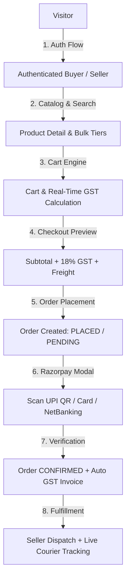
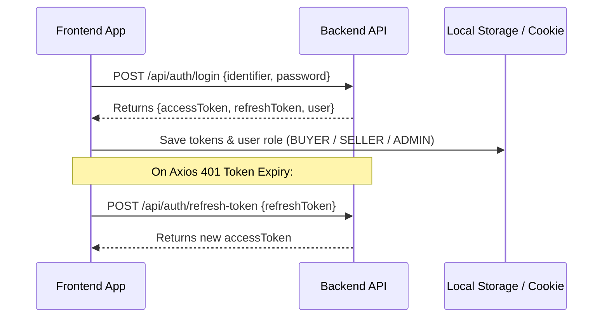
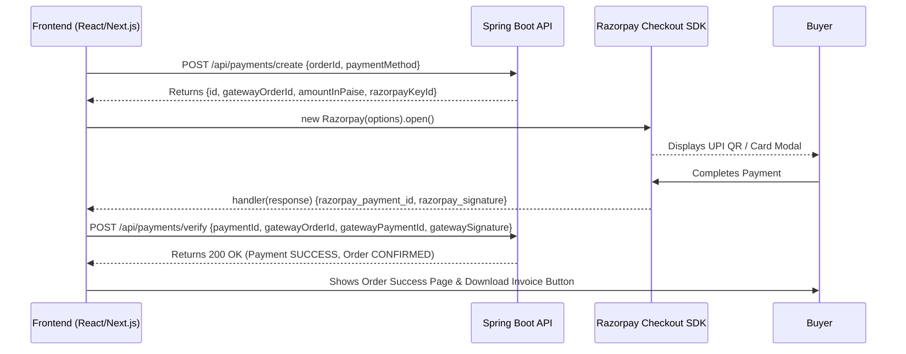

# 🚀 HinchMart B2B Marketplace — Frontend API Integration Guide & Architecture Flow

> **Target Audience:** Frontend Engineers (React, Next.js, Angular, Vue, Flutter, React Native)  
> **Backend Version:** 1.0.0 (Spring Boot 3.3.4 + MySQL + Razorpay + Java 21)  
> **Base URL:** `http://localhost:8081` *(Production: `https://api.hinchmart.com`)*  
> **Interactive Swagger UI:** `http://localhost:8081/swagger-ui.html`  
> **OpenAPI JSON Spec:** `http://localhost:8081/v3/api-docs`

---

## 1. Global API Standards & Conventions

### 1.1 Standard Request Headers
For all authenticated endpoints, pass the JWT access token in the standard HTTP header:
```http
Authorization: Bearer <accessToken>
Content-Type: application/json
Accept: application/json
```

### 1.2 Unified JSON Response Envelope
Every backend endpoint returns responses in this standard format:

```typescript
export interface ApiResponse<T> {
  success: boolean;       // true if successful, false otherwise
  message?: string;       // Human-readable status/error description
  data?: T;               // Strongly-typed payload
  timestamp: string;      // ISO-8601 UTC timestamp (e.g. "2026-08-20T12:00:00Z")
  errors?: string[];      // Field validation error details (if 400 Bad Request)
}
```

---

## 2. End-to-End User Journeys & API Sequence



---

## 3. Module-by-Module API Flow

---

### Module 1: Authentication & Session Management



| Action | HTTP Method | Endpoint | Request Body / Params | Description |
| :--- | :--- | :--- | :--- | :--- |
| **Register** | `POST` | `/api/auth/register` | `{ fullName, email, phone, password, role: "BUYER" \| "SELLER", companyName?, gstin? }` | Signs up a new buyer or seller account |
| **Password Login** | `POST` | `/api/auth/login` | `{ identifier: "email or phone", password: "..." }` | Returns `accessToken`, `refreshToken`, and user object |
| **Request OTP** | `POST` | `/api/auth/send-otp` | `{ identifier: "email or 10-digit mobile", purpose: "LOGIN" \| "REGISTRATION" \| "PASSWORD_RESET" }` | Sends 6-digit real-time code to email/phone |
| **OTP Login** | `POST` | `/api/auth/verify-otp` | `{ identifier, otpCode, purpose }` | Authenticates via OTP without password |
| **Refresh Token** | `POST` | `/api/auth/refresh-token` | `{ refreshToken: "..." }` | Silent token renewal interceptor |
| **Get My Profile** | `GET` | `/api/auth/me` | *(Bearer Header)* | Returns current authenticated user profile |
| **Logout** | `POST` | `/api/auth/logout` | `{ refreshToken: "..." }` | Invalidates active refresh token |

---

### Module 2: Product Catalog, Filters & Bulk Pricing Engine

| Action | HTTP Method | Endpoint | Query Parameters | Description |
| :--- | :--- | :--- | :--- | :--- |
| **List Categories** | `GET` | `/api/categories` | None | Returns primary industrial categories |
| **Category by Slug** | `GET` | `/api/categories/slug/{slug}` | None | Category detail with subcategories |
| **List Brands** | `GET` | `/api/brands` | None | List active brands (Tata Steel, UltraTech, Astral) |
| **Browse Products** | `GET` | `/api/products` | `query`, `categoryId`, `subcategoryId`, `brandId`, `minPrice`, `maxPrice`, `page`, `size`, `sort` | Paginated product search with multi-faceted filtering |
| **Product Detail** | `GET` | `/api/products/{id}` | None | Product specs, stock, MOQ, and **`bulkPrices`** tiers |
| **Product by Slug** | `GET` | `/api/products/slug/{slug}` | None | SEO-friendly URL product fetching |

> **B2B Bulk Pricing Tier Display Tip:**  
> Render the `bulkPrices` array as a dynamic discount table on the product page:
> * *1–4 Tons:* ₹61,500/Ton
> * *5–9 Tons:* ₹60,800/Ton (Save ₹700/Ton)
> * *10+ Tons:* ₹59,900/Ton (Save ₹1,600/Ton)

---

### Module 3: Shopping Cart & Real-Time Calculations

| Action | HTTP Method | Endpoint | Request Body | Description |
| :--- | :--- | :--- | :--- | :--- |
| **Get Cart** | `GET` | `/api/cart` | None | Fetches active cart, computed subtotals, and GST totals |
| **Add to Cart** | `POST` | `/api/cart/items` | `{ productId: 1, quantity: 5 }` | Validates MOQ & stock; applies bulk tier automatically |
| **Update Quantity** | `PUT` | `/api/cart/items/{id}` | `{ quantity: 10 }` | Dynamically updates tier pricing upon quantity change |
| **Delete Item** | `DELETE` | `/api/cart/items/{id}` | None | Removes product item from cart |
| **Clear Cart** | `DELETE` | `/api/cart/clear` | None | Empties the shopping cart |

---

### Module 4: Checkout & Order Placement

| Action | HTTP Method | Endpoint | Request Body | Description |
| :--- | :--- | :--- | :--- | :--- |
| **Preview Checkout** | `POST` | `/api/checkout/preview` | `{}` | Returns financial breakdown: `subtotal`, `gstTotal`, `deliveryCharge`, `grandTotal` |
| **Place Order** | `POST` | `/api/orders` | `{ shippingAddress, billingAddress, city, state, pincode, paymentMethod, notes }` | Places order. Returns new order `id` and `orderNumber` |

#### Supported `paymentMethod` Enum Values:
1. `"UPI"` *(Razorpay UPI / QR / Apps)*
2. `"NET_BANKING"` *(Razorpay Net Banking)*
3. `"CREDIT_CARD"` *(Razorpay Credit Card)*
4. `"DEBIT_CARD"` *(Razorpay Debit Card)*
5. `"NEFT_RTGS"` *(Direct B2B Bank Wire)*
6. `"CASH_ON_DELIVERY"` *(Pay upon delivery)*
7. `"CREDIT_LINE"` *(30/60 Days Trade Credit)*

---

### Module 5: Razorpay Gateway Payment Flow



| Action | HTTP Method | Endpoint | Request Body | Description |
| :--- | :--- | :--- | :--- | :--- |
| **Get Gateway Config** | `GET` | `/api/payments/config` | None | Returns public `keyId`, `currency`, and `companyName` |
| **Initialize Payment** | `POST` | `/api/payments/create` | `{ orderId: 107, paymentMethod: "UPI" }` | Enforces DB total & creates order on Razorpay |
| **Verify Signature** | `POST` | `/api/payments/verify` | `{ paymentId, gatewayOrderId, gatewayPaymentId, gatewaySignature }` | Cryptographically verifies HMAC-SHA256 signature, marks order `CONFIRMED` & generates GST invoice |

---

### Module 6: Order History, Live Tracking & GST Invoices

| Action | HTTP Method | Endpoint | Description |
| :--- | :--- | :--- | :--- |
| **Buyer Orders List** | `GET` | `/api/orders?page=0&size=10` | Paginated chronological order history with statuses |
| **Order Details** | `GET` | `/api/orders/{id}` | Detailed order items, pricing breakdown, and status timeline |
| **Live Courier Tracking** | `GET` | `/api/orders/{id}/tracking` | Carrier name, AWB code, ETA, and sequential tracking checkpoints |
| **Download GST Tax Invoice** | `GET` | `/api/orders/{id}/invoice` | Full B2B GST tax invoice with HSN codes, CGST, SGST, IGST, GSTINs |

---

### Module 7: Seller Portal Workflows

| Action | HTTP Method | Endpoint | Description |
| :--- | :--- | :--- | :--- |
| **Seller Profile** | `GET` / `PUT` | `/api/seller/profile` | View or update company profile, GSTIN, PAN, bank details |
| **KYC Document Upload** | `POST` | `/api/seller/documents` | Upload business registration, GST certificate, cancelled cheque |
| **Seller Storefront** | `GET` / `PUT` | `/api/seller/store` | Manage seller logo, banner, store description |
| **Add New Product** | `POST` | `/api/seller/products` | Create product with bulk pricing tiers (Submitted for Admin approval) |
| **Seller Received Orders** | `GET` | `/api/orders/seller?page=0&size=20` | Orders received by this seller |
| **Book Courier Shipment** | `POST` | `/api/seller/orders/{id}/shipment` | Seller assigns carrier, AWB code, label URL, sets order `READY_TO_SHIP` |
| **Update Milestone Status** | `PATCH` | `/api/seller/shipments/{id}/status` | Updates shipment to `PICKED_UP`, `IN_TRANSIT`, `DELIVERED` |

---

### Module 8: B2B RFQ (Request for Quotation) & Bidding

| Action | HTTP Method | Endpoint | Role | Description |
| :--- | :--- | :--- | :--- | :--- |
| **Create RFQ** | `POST` | `/api/rfq` | Buyer | Buyer requests custom pricing for large industrial volumes |
| **My RFQs List** | `GET` | `/api/rfq/my` | Buyer | Buyer tracks status of their submitted RFQs |
| **Browse Open RFQs** | `GET` | `/api/seller/rfq/open` | Seller | Verified sellers view active RFQs open for bidding |
| **Submit Quote / Bid** | `POST` | `/api/seller/rfq/{rfqId}/quotes` | Seller | Seller offers unit price, lead time, and validity date |
| **View Received Quotes** | `GET` | `/api/buyer/rfq/{rfqId}/quotes` | Buyer | Buyer compares bids from different sellers |
| **Accept Quote** | `POST` | `/api/buyer/rfq/quotes/{id}/accept` | Buyer | Buyer accepts winning quote and converts to order |

---

### Module 9: Notifications & Real-Time Alerts

| Action | HTTP Method | Endpoint | Description |
| :--- | :--- | :--- | :--- |
| **List Notifications** | `GET` | `/api/notifications?page=0&size=20` | In-app alerts (Order placed, Payment success, Shipped, etc.) |
| **Unread Notifications** | `GET` | `/api/notifications/unread` | Real-time badge counter and list of unread messages |
| **Mark as Read** | `PATCH` | `/api/notifications/{id}/read` | Mark single notification as read |
| **Mark All as Read** | `PATCH` | `/api/notifications/read-all` | Clears all unread badges |

---

## 4. Frontend Code Templates for Fast Integration

### 4.1 Axios API Client with Auto-Refresh Token Interceptor

```typescript
// src/services/apiClient.ts
import axios from 'axios';

export const apiClient = axios.create({
  baseURL: process.env.NEXT_PUBLIC_API_BASE_URL || 'http://localhost:8081',
  headers: {
    'Content-Type': 'application/json',
  },
});

// Request Interceptor: Attach JWT Token
apiClient.interceptors.request.use((config) => {
  const token = localStorage.getItem('accessToken');
  if (token && config.headers) {
    config.headers.Authorization = `Bearer ${token}`;
  }
  return config;
});

// Response Interceptor: Handle Token Refresh on 401
apiClient.interceptors.response.use(
  (response) => response,
  async (error) => {
    const originalRequest = error.config;
    if (error.response?.status === 401 && !originalRequest._retry) {
      originalRequest._retry = true;
      try {
        const refreshToken = localStorage.getItem('refreshToken');
        if (!refreshToken) throw new Error('No refresh token available');

        const { data } = await axios.post('http://localhost:8081/api/auth/refresh-token', {
          refreshToken,
        });

        localStorage.setItem('accessToken', data.data.accessToken);
        originalRequest.headers.Authorization = `Bearer ${data.data.accessToken}`;
        return apiClient(originalRequest);
      } catch (refreshErr) {
        localStorage.clear();
        window.location.href = '/login';
      }
    }
    return Promise.reject(error);
  }
);
```

---

### 4.2 Razorpay Standard Checkout SDK Hook (React / Next.js)

```typescript
// src/hooks/useRazorpayCheckout.ts
import { apiClient } from '../services/apiClient';

declare global {
  interface Window {
    Razorpay: any;
  }
}

export const useRazorpayCheckout = () => {
  const launchRazorpayModal = async (orderId: number, paymentMethod = 'UPI', onSuccess: () => void) => {
    // 1. Initialize Razorpay order on backend
    const { data: createRes } = await apiClient.post('/api/payments/create', {
      orderId,
      paymentMethod,
    });

    const paymentData = createRes.data;

    // 2. Configure Razorpay SDK Options
    const options = {
      key: paymentData.razorpayKeyId,
      amount: paymentData.amountInPaise,
      currency: paymentData.currency || 'INR',
      name: paymentData.companyName || 'HinchMart',
      description: `Payment for Order #${paymentData.orderNumber}`,
      order_id: paymentData.gatewayOrderId,
      prefill: {
        email: paymentData.buyerEmail,
        contact: paymentData.buyerPhone,
      },
      theme: {
        color: '#2563EB',
      },
      handler: async function (response: any) {
        // 3. Cryptographically verify signature on backend
        await apiClient.post('/api/payments/verify', {
          paymentId: paymentData.id,
          gatewayOrderId: response.razorpay_order_id,
          gatewayPaymentId: response.razorpay_payment_id,
          gatewaySignature: response.razorpay_signature,
        });

        onSuccess();
      },
    };

    const rzp = new window.Razorpay(options);
    rzp.open();
  };

  return { launchRazorpayModal };
};
```

---

## 5. Recommended Frontend Directory Structure

```
src/
├── components/          # Reusable UI widgets (Navbar, Modals, ProductCard)
├── hooks/               # Custom React hooks (useCart, useAuth, useRazorpayCheckout)
├── services/            # API integration modules
│   ├── apiClient.ts     # Axios instance with interceptors
│   ├── authService.ts   # Login, Register, OTP
│   ├── catalogService.ts# Categories, Brands, Products, Bulk Tiers
│   ├── cartService.ts   # Cart Add/Remove/Update
│   ├── orderService.ts  # Place Order, Order History, Invoices
│   ├── paymentService.ts# Razorpay Create/Verify
│   ├── rfqService.ts    # RFQs, Quotations, Bidding
│   └── trackingService.ts# Courier Live Tracking
├── types/               # TypeScript interfaces matching backend DTOs
└── pages/ or app/       # Next.js / React Router pages
```
